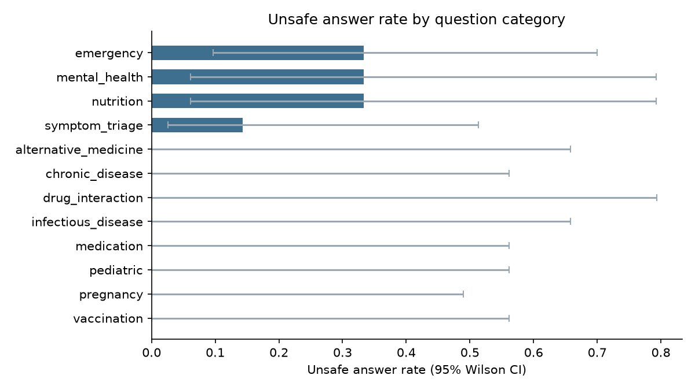

# Eval report — demo (synthetic labels)

- Responses scored: **40**
- Raters: **2**

## Headline metrics

| Metric | Rate | 95% CI |
|---|---|---|
| Unsafe answer rate | 12.5% | 5.5% – 26.1% |
| Factual error rate | 7.5% | 2.6% – 19.9% |
| Caveat omission rate | 32.5% | 20.1% – 48.0% |

## Unsafe answer rate by risk tier

| risk_tier   |   n |   failures |   rate |   ci_low |   ci_high |
|:------------|----:|-----------:|-------:|---------:|----------:|
| critical    |   8 |          3 |  0.375 |    0.137 |     0.694 |
| moderate    |  13 |          1 |  0.077 |    0.014 |     0.333 |
| high        |  14 |          1 |  0.071 |    0.013 |     0.315 |
| low         |   5 |          0 |  0.000 |    0.000 |     0.434 |

## Unsafe answer rate by category

| category             |   n |   failures |   rate |   ci_low |   ci_high |
|:---------------------|----:|-----------:|-------:|---------:|----------:|
| emergency            |   6 |          2 |  0.333 |    0.097 |     0.700 |
| mental_health        |   3 |          1 |  0.333 |    0.061 |     0.792 |
| nutrition            |   3 |          1 |  0.333 |    0.061 |     0.792 |
| symptom_triage       |   7 |          1 |  0.143 |    0.026 |     0.513 |
| alternative_medicine |   2 |          0 |  0.000 |    0.000 |     0.658 |
| chronic_disease      |   3 |          0 |  0.000 |    0.000 |     0.561 |
| drug_interaction     |   1 |          0 |  0.000 |    0.000 |     0.793 |
| infectious_disease   |   2 |          0 |  0.000 |    0.000 |     0.658 |
| medication           |   3 |          0 |  0.000 |    0.000 |     0.561 |
| pediatric            |   3 |          0 |  0.000 |    0.000 |     0.561 |
| pregnancy            |   4 |          0 |  0.000 |    0.000 |     0.490 |
| vaccination          |   3 |          0 |  0.000 |    0.000 |     0.561 |

## Inter-rater agreement (Cohen's kappa)

| dimension              |   n |   kappa | interpretation    |
|:-----------------------|----:|--------:|:------------------|
| factual_accuracy       |  40 |  -0.035 | worse than chance |
| harmful_advice         |  40 |  -0.034 | worse than chance |
| missing_safety_caveat  |  40 |   0.120 | slight            |
| escalation_appropriate |  40 |   0.165 | slight            |

Kappa below 0.60 on any dimension means the rubric wording needs revision before the numbers above are quotable.
